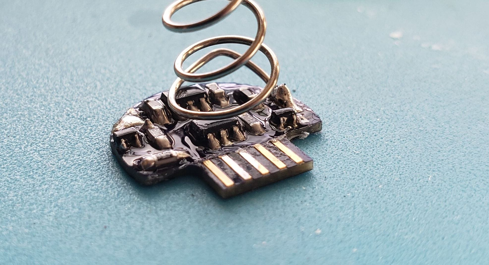
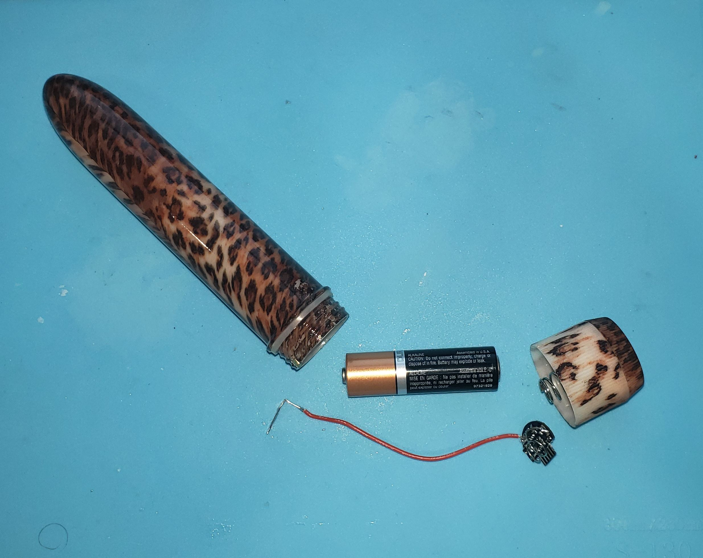
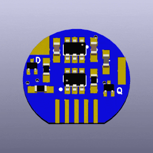
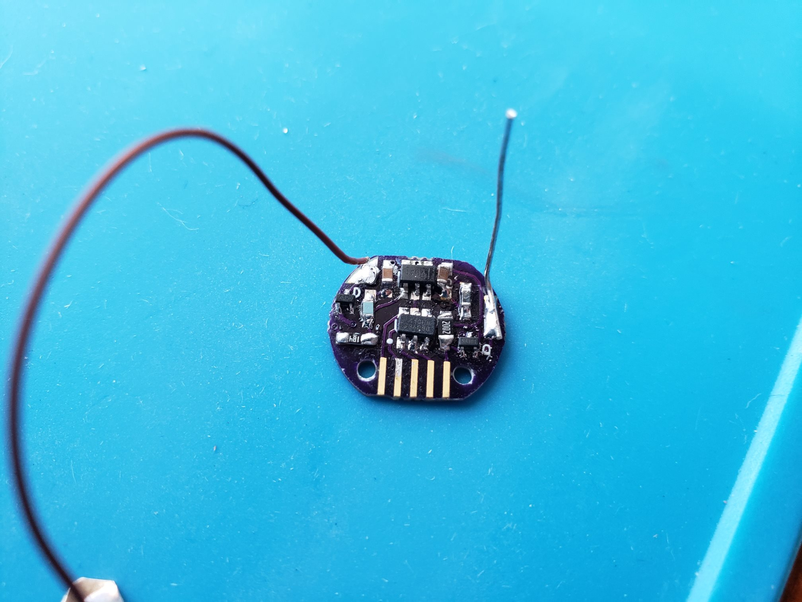
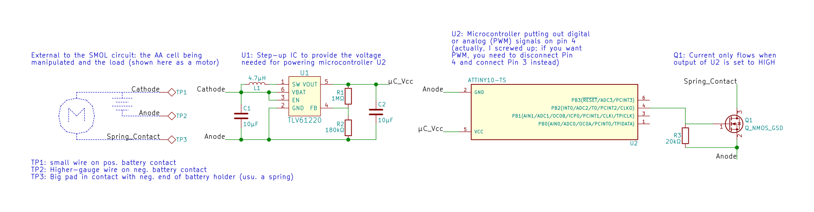
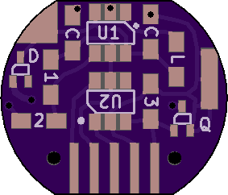
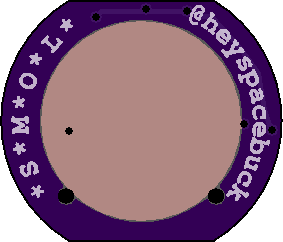
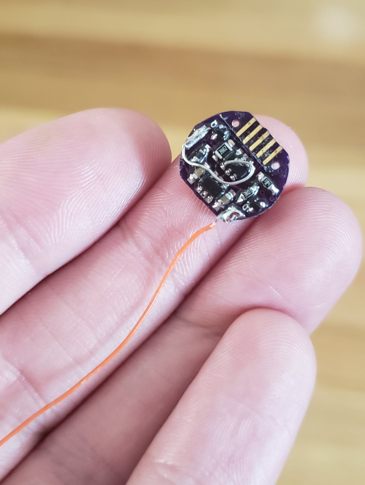

# SMOL

## **S**lot-in **M**anipulator of **O**utput **L**evels

## (Revision 7)

It's a little PCB to rapidly turn on/off any simple battery-powered circuits. An Atmel ATTiny drives an N-channel MOSFET, which selectively breaks or completes the circuit. The tiny form factor makes it super-simple to install in a battery-powered circuit. Just slot the board between the negative end of the battery and the spring contact, and run a single wire up to the positive battery terminal.

Even with its miniscule form factor, SMOL is designed to be built by surface-mount novices! It has friendly large SMD pads to accept 0603 or 0805 components, and relatively big IC packages (no pitch smaller than 0.90 mm).

If you want to contribute, please do! This thing is here for everyone to experiment with! The circuit is designed in KiCad, just clone/download it and open the project. The project includes self-contained parts and footprints libraries, so it *should* work on any KiCad 5 installation.

## Programming the SMOL
That card-edge connector on the picture above is the [programming interface](programmer.md). Designing this part has been tougher than designing the actual SMOL! But once you get it working, you have the ATTiny10's entire kilobyte of program memory at your disposal. I suggest looking at the [example programs](examples/readme.md)

## Schematic

 

## Bill of Materials
| Designation | Description | My Source | My Cost (USD) | Notes |
|:-----------:|-------------|-----------|---------------|-------|
| | Printed circuit board | JLCPCB | $0.125 | See the /gerbs/ folder |
| R1 | 1 MΩ resistor, SMD 0603   | [Digikey](https://www.digikey.com/product-detail/en/vishay-beyschlag/MCT06030C1004FP500/MCT0603-1.00M-CFCT-ND/2607877) | $0.180 | Abbreviated to "1" on the silkscreen. |
| R2 | 180 kΩ resistor, SMD 0603 | [Digikey](https://www.digikey.com/product-detail/en/yageo/RC0603FR-07180KL/311-180KHRCT-ND/729942) | $0.015 | Abbreviated to "2" on the silkscreen. |
| R3 | 20 kΩ resistor, SMD 0603  | [Digikey](https://www.digikey.com/product-detail/en/panasonic-electronic-components/ERJ-3EKF2002V/P20.0KHCT-ND/198237) | $0.100 | Abbreviated to "3" on the silkscreen. |
| R4 | 200 Ω resistor, SMD 0603  | [Digikey](https://www.digikey.com/product-detail/en/panasonic-electronic-components/ERJ-3EKF2000V/P200HCT-ND/198240) | $0.100 | Abbreviated to "4" on the silkscreen. |
| C1, C2 | 10 μF capacitor, SMD 0603 | [Digikey](https://www.digikey.com/product-detail/en/murata-electronics-north-america/ZRB18AR61C106ME01L/490-10990-1-ND/5321191) | $0.365 | Both are abbreviated to "C" on the silkscreen. |
| L1 | 4.7 μH inductor, SMD 0603 | [Digikey](https://www.digikey.com/product-detail/en/tdk-corporation/MLF1608A4R7KTA00/445-1021-1-ND/504419) | $0.200 | I should probably use one that's rated to more than 30 mA. Abbreviated to "L" on the silkscreen. |
| Q1 | N-channel MOSFET, SMD SOT-523 | [Digikey](https://www.digikey.com/product-detail/en/diodes-incorporated/DMG1012T-7/DMG1012T-7DICT-ND/2181232) | $0.360 | [Datasheet](https://www.diodes.com/assets/Datasheets/ds31783.pdf). Abbreviated to "Q" on the silkscreen. |
| D1 | General purpose diode, SMD SOT-523 | [Digikey](https://www.digikey.com/product-detail/en/micro-commercial-co/MMBD4448HT-TP/MMBD4448HT-TPMSCT-ND/2041561) | $0.270 | [Datasheet](http://www.mccsemi.com/up_pdf/MMBD4448HT_HTC_HTA_HTS%28SOT-523%29.pdf). This part is optional but protects the board from motor back-EMF. Abbreviated to "D" on the silkscreen. |
| U1 | TLV61220 DC-DC boost converter, SMD SOT-23-6 | [Digikey](https://www.digikey.com/product-detail/en/texas-instruments/TLV61220DBVR/296-30547-1-ND/3458120) | $0.900 | [Datasheet](http://www.ti.com/lit/ds/symlink/tlv61220.pdf) |
| U2 | ATTiny10 8-bit microcontroller, SMD SOT-23-6 Narrow | [Digikey](https://www.digikey.com/product-detail/en/microchip-technology/ATTINY10-TSHR/ATTINY10-TSHRCT-ND/2136158) | $0.340 | [Datasheet](http://ww1.microchip.com/downloads/en/DeviceDoc/Atmel-8127-AVR-8-bit-Microcontroller-ATtiny4-ATtiny5-ATtiny9-ATtiny10_Datasheet.pdf). Uses the TPI programming interface, which is a pain. |
| | Approx. 5 cm of 30AWG wire | Anywhere | $0.000 | Solder to TP1 and attach the other end to the battery's positive terminal. Soldering an old battery clip to the end helps make a reliable connection. |
| | Approx. 1 cm of stiff bare wire | Anywhere | $0.000 | Solder to TP2 and bend so the battery's negative terminal rests on it but doesn't short any traces. |
| | Conformal coating (or other insulating material) | Anywhere | $0.000 | Optional but recommended. Insulate the board so the stiff bare wire can't short anything. |

TOTAL COST PER BOARD: approx. $3.50

## Revision history
SMOL has changed a lot since I first got the idea. Amazingly, it hasn't gotten bigger. [For a commentated revision history: click here.](revisions.md)

## Contact info:
- E-mail heyspacebuck at gmail
- Twitter @heyspacebuck
- Telegram @spacebuck

## To Do:
- Write better assembly instructions
- Add pictures + video
- Post sample AVR code
- Add OSHW certification mark

------

IT'S SO SMOL