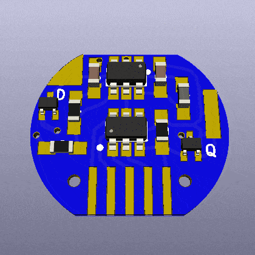

# SMOL
## **S**lot-in **M**anipulator of **O**utput **L**evels

I whipped up a little PCB to rapidly turn on/off any simple battery-powered circuits. An Atmel ATTiny drives an N-channel MOSFET, which selectively breaks or completes the circuit. To be perfectly frank, I designed it to pulse the output of a cheap vibrator (and GOSH, it works).

I want this to be super-simple to install in a battery-powered circuit. Just slot the board between the negative end of the battery and the spring contact, and run a single wire up to the positive battery terminal.

If you want to contribute, please do! This thing is here for everyone to experiment with! The circuit is designed in KiCad, just clone/download it and open the project. The project includes self-contained parts and footprints libraries, so it *should* work on any KiCad installation.

## Bill of Materials
| Designation | Description | My Source | My Cost (USD) | Notes |
|:-----------:|-------------|-----------|---------------|-------|
| R1 | 1 MΩ resistor, SMD 0603   | [Digikey](https://www.digikey.com/product-detail/en/vishay-beyschlag/MCT06030C1004FP500/MCT0603-1.00M-CFCT-ND/2607877) | $0.180 | |
| R2 | 180 kΩ resistor, SMD 0603 | [Digikey](https://www.digikey.com/product-detail/en/yageo/RC0603FR-07180KL/311-180KHRCT-ND/729942) | $0.015 |  |
| R3 | 1 kΩ resistor, SMD 0603   | [Digikey](https://www.digikey.com/product-detail/en/panasonic-electronic-components/ERJ-3EKF1001V/P1.00KHCT-ND/198071) | $0.100 | Not sure how necessary this is. I may make this a pull-down resistor. |
| C1, C2 | 10 μF capacitor, SMD 0603 | [Digikey](https://www.digikey.com/product-detail/en/murata-electronics-north-america/ZRB18AR61C106ME01L/490-10990-1-ND/5321191) | $0.365 | |
| L1 | 4.7 μH inductor, SMD 0603 | [Digikey](https://www.digikey.com/product-detail/en/tdk-corporation/MLF1608A4R7KTA00/445-1021-1-ND/504419) | $0.200 | I should probably use one that's rated to more than 30 mA. |
| Q1 | N-channel MOSFET, SMD SOT-523 | [Digikey](https://www.digikey.com/product-detail/en/diodes-incorporated/DMG1012T-7/DMG1012T-7DICT-ND/2181232) | $0.360 | [Datasheet](https://www.diodes.com/assets/Datasheets/ds31783.pdf) |
| U1 | TLV61220 DC-DC boost converter, SMD SOT-23-6 | [Digikey](https://www.digikey.com/product-detail/en/texas-instruments/TLV61220DBVR/296-30547-1-ND/3458120) | $0.900 | [Datasheet](http://www.ti.com/lit/ds/symlink/tlv61220.pdf) |
| U2 | ATTiny13 8-bit microcontroller, SMD SOIC-8 Narrow | [Digikey](https://www.digikey.com/product-detail/en/microchip-technology/ATTINY13A-SSUR/ATTINY13A-SSURCT-ND/3789485) | $0.590 | [Datasheet](http://ww1.microchip.com/downloads/en/DeviceDoc/8126S.pdf). I plan to change this to the SOT-23-6 ATTiny10. |
| | Printed circuit board | Osh Park | $0.467 | See the /gerbs/ folder |
| | Approx. 6 cm of 30ish gauge wire | Anywhere | $0.000 | Solder to TP1 and attach the other end to the battery's positive terminal |
| | Approx. 1 cm of stiff wire | Anywhere | $0.000 | Solder to TP2 and bend so the battery's negative terminal rests on it but doesn't short any traces |

TOTAL COST PER BOARD: $3.542

## Contact info:
- Twitter @heyspacebuck
- Telegram @spacebuck

## To Do:
- Write better assembly instructions
- Add pictures
- Make the traces thicker between negative battery and negative battery terminal
- Swap out ATTiny13 for ATTiny10, add dedicated ISP pads
- Post sample AVR code (this may not happen till I figure out sleep mode on the ATTiny)
- Add OSHW certification mark
- Figure out a way to get rid of the DC-DC step-up stage entirely?
