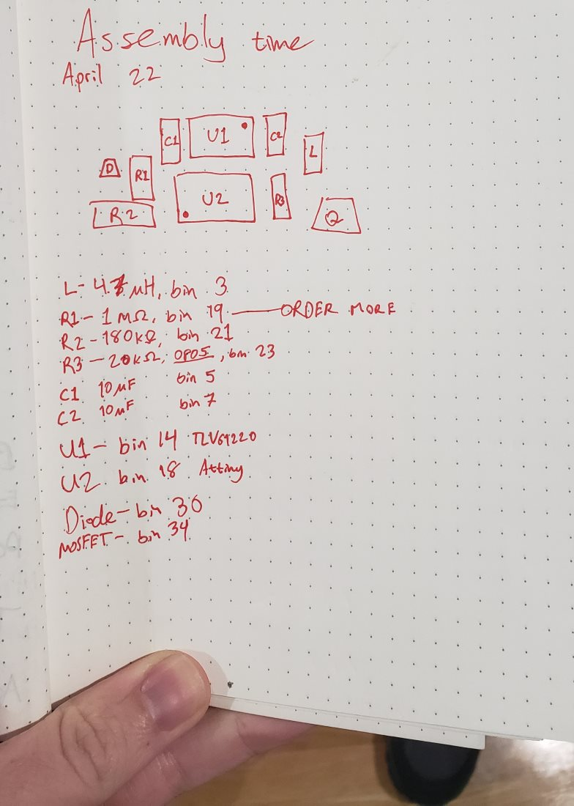
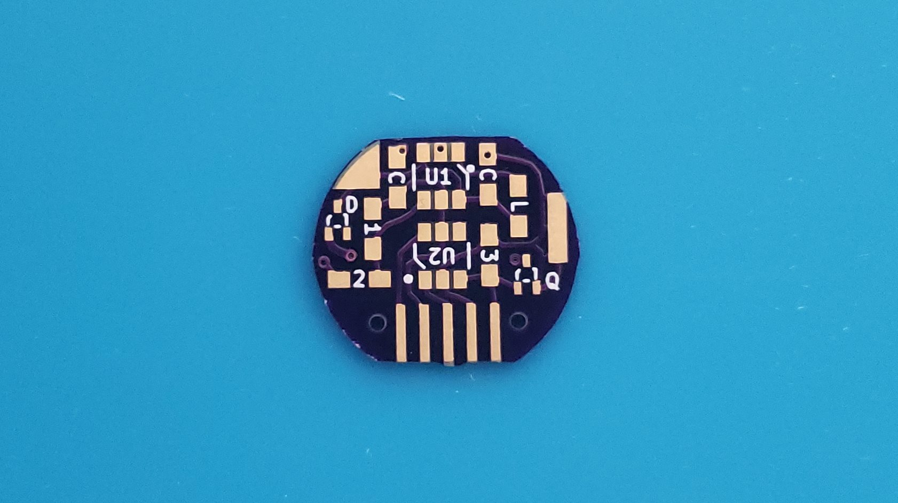
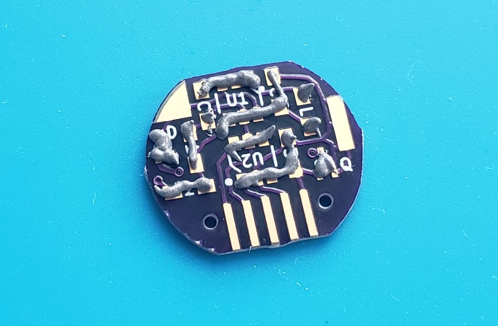
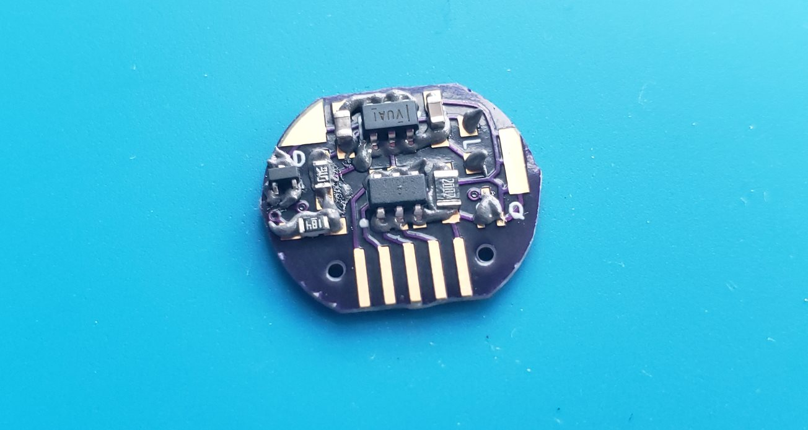
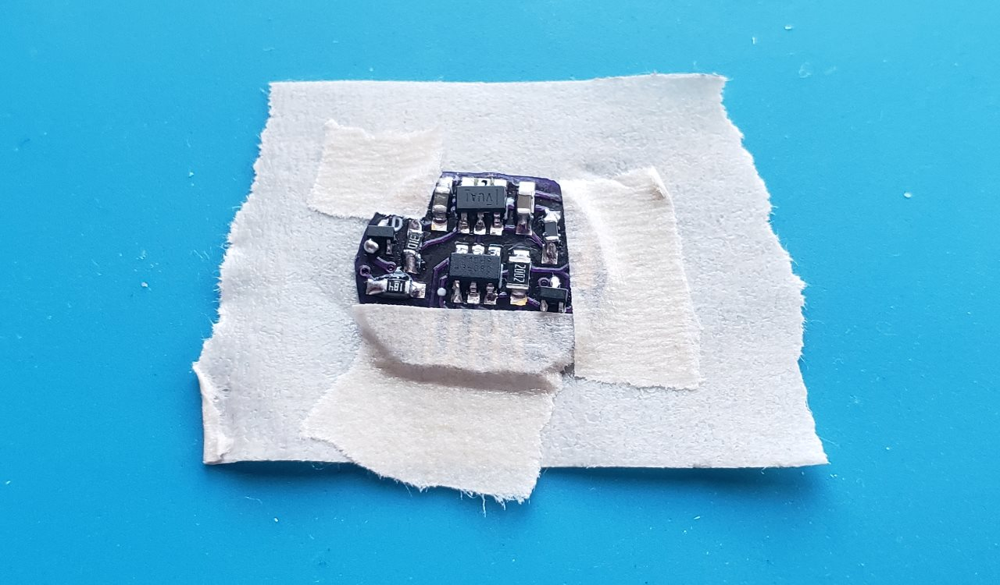
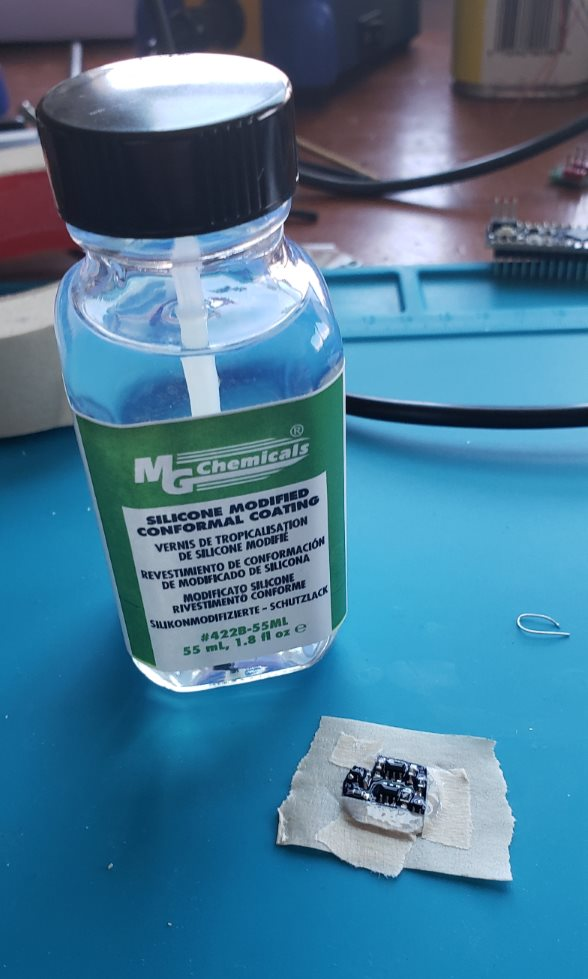
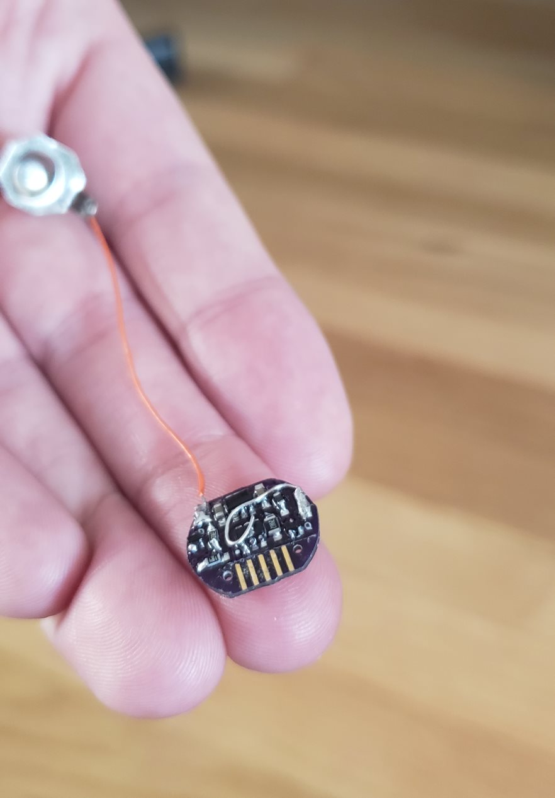

# SMOL assembly instructions

Instructions are coming soon!

## Bill of Materials
| Designation | Description | My Source | My Cost (USD) | Notes |
|:-----------:|-------------|-----------|---------------|-------|
| | Printed circuit board | JLCPCB | $0.125 | See the /gerbs/ folder |
| R1 | 1 MΩ resistor, SMD 0603   | [Digikey](https://www.digikey.com/product-detail/en/vishay-beyschlag/MCT06030C1004FP500/MCT0603-1.00M-CFCT-ND/2607877) | $0.180 | Abbreviated to "1" on the silkscreen. |
| R2 | 180 kΩ resistor, SMD 0603 | [Digikey](https://www.digikey.com/product-detail/en/yageo/RC0603FR-07180KL/311-180KHRCT-ND/729942) | $0.015 | Abbreviated to "2" on the silkscreen. |
| R3 | 20 kΩ resistor, SMD 0603  | [Digikey](https://www.digikey.com/product-detail/en/panasonic-electronic-components/ERJ-3EKF2002V/P20.0KHCT-ND/198237) | $0.100 | Abbreviated to "3" on the silkscreen. |
| R4 | 200 Ω resistor, SMD 0603  | [Digikey](https://www.digikey.com/product-detail/en/panasonic-electronic-components/ERJ-3EKF2000V/P200HCT-ND/198240) | $0.100 | Abbreviated to "4" on the silkscreen. |
| C1, C2 | 10 μF capacitor, SMD 0603 | [Digikey](https://www.digikey.com/product-detail/en/murata-electronics-north-america/ZRB18AR61C106ME01L/490-10990-1-ND/5321191) | $0.365 | Both are abbreviated to "C" on the silkscreen. |
| L1 | 4.7 μH inductor, SMD 0603 | [Digikey](https://www.digikey.com/product-detail/en/tdk-corporation/MLF1608A4R7KTA00/445-1021-1-ND/504419) | $0.200 | I should probably use one that's rated to more than 30 mA. Abbreviated to "L" on the silkscreen. |
| Q1 | N-channel MOSFET, SMD SOT-523 | [Digikey](https://www.digikey.com/product-detail/en/diodes-incorporated/DMG1012T-7/DMG1012T-7DICT-ND/2181232) | $0.360 | [Datasheet](https://www.diodes.com/assets/Datasheets/ds31783.pdf). Abbreviated to "Q" on the silkscreen. |
| D1 | General purpose diode, SMD SOT-523 | [Digikey](https://www.digikey.com/product-detail/en/micro-commercial-co/MMBD4448HT-TP/MMBD4448HT-TPMSCT-ND/2041561) | $0.270 | [Datasheet](http://www.mccsemi.com/up_pdf/MMBD4448HT_HTC_HTA_HTS%28SOT-523%29.pdf). This part is optional but protects the board from motor back-EMF. Abbreviated to "D" on the silkscreen. |
| U1 | TLV61220 DC-DC boost converter, SMD SOT-23-6 | [Digikey](https://www.digikey.com/product-detail/en/texas-instruments/TLV61220DBVR/296-30547-1-ND/3458120) | $0.900 | [Datasheet](http://www.ti.com/lit/ds/symlink/tlv61220.pdf) |
| U2 | ATTiny10 8-bit microcontroller, SMD SOT-23-6 Narrow | [Digikey](https://www.digikey.com/product-detail/en/microchip-technology/ATTINY10-TSHR/ATTINY10-TSHRCT-ND/2136158) | $0.340 | [Datasheet](http://ww1.microchip.com/downloads/en/DeviceDoc/Atmel-8127-AVR-8-bit-Microcontroller-ATtiny4-ATtiny5-ATtiny9-ATtiny10_Datasheet.pdf). Uses the TPI programming interface, which is a pain. |
| | Approx. 5 cm of 30AWG wire | Anywhere | $0.000 | Solder to TP1 and attach the other end to the battery's positive terminal. Soldering an old battery clip to the end helps make a reliable connection. |
| | Approx. 1 cm of stiff bare wire | Anywhere | $0.000 | Solder to TP2 and bend so the battery's negative terminal rests on it but doesn't short any traces. |
| | Conformal coating (or other insulating material) | Anywhere | $0.000 | Optional but recommended. Insulate the board so the stiff bare wire can't short anything. |

