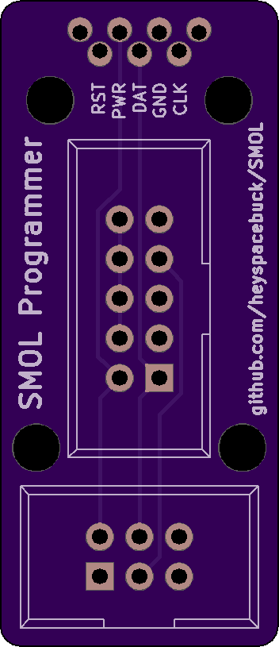
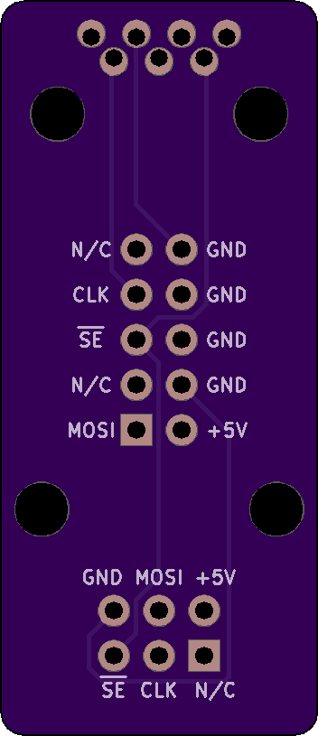

# Tiny Programming Interface (TPI) programmers for SMOL

 
This design works with USBasp or a breadboard if you are using [this programming approach](http://www.technoblogy.com/show?1YQY).

 
This design works with the Arduino Nano (or breadboard) if you are using [this programming approach](http://junkplusarduino.blogspot.com/p/attiny10-resources.html).

The ATTiny10 at the heart of the SMOL can't be programmed like other ATTiny ICs. Instead of the normal 6-wire SPI (Serial Programming Interface) protocol, the ATTiny4/5/9/10 family use the 5-wire TPI (Tiny Programming Interface) protocol. Tutorials on working with TPI are relatively scarce. If you have a [Fischl USBasp](https://www.fischl.de/usbasp/) (or a knockoff that still supports low-clock-speed programming), you can write and upload your AVR program within the Arduino IDE by [following this landmark tutorial by Johnson Davies](http://www.technoblogy.com/show?1YQY). If you don't have USBasp, you can still upload compiled programs using this [very clever, very janky Arduino sketch](http://junkplusarduino.blogspot.com/p/attiny10-resources.html). Atmel Studio *should* work as an IDE but I haven't had any luck yet—contact me if you figure it out!

No matter what software you use, you'll need some additional hardware to connect your SMOL and your computer. On SMOL revision 6 (and rev. 6b, and rev. 6c), the five TPI signals are routed to the five copper fingers, with a 50 mil (1.27 mm) pitch. On SMOL rev. 6b and rev. 6c, there are non-plated through-holes (NPTH) to help align the programmer and the SMOL fingers.

## The least-bad programmer thus far

I'm using the classic [spring-loaded pogo pin](https://www.adafruit.com/product/2430) to make a reliable electrical connection between boards. These can be bought in bulk from lots of places—just make sure to get ones that are approx. 1mm diameter at their widest point.

The programmer has space for seven pogo pins: five signals and two alignment pins. The alignment pins should slide nicely into the 0.8mm diameter non-plated holes on SMOL, thereby forcing the five signal pins to accurately align themselves. The seven pogo pins are soldered into the programmer; be very careful on this step!

## Other attempts at SMOL programmers

My first programmers were wires soldered to bare pads. After that I tried programmers with mating fingers slid against the SMOL. This worked alright, but requires a lot of force to keep the programmer pressed against the SMOL, which started to take a toll on my poor fingertips:

 

In an attempt to work smarter, not harder, I made this sandwich programmer, which doesn't work well but is still my favorite design:

  

The middle PCB has a cutout to perfectly line up the SMOL, the top one has mating fingers, and the bottom one...well, I shouldn't have used a bottom PCB; I should have used some sort of spring apparatus to press the SMOL against the top fingers. In the 3-layer sandwich design, there's enough play that this programmer only works about 5% of the time. I still think this approach shows promise, but I can't figure out an economical way to make or buy card-edge receptacles for five fingers at 0.050" pitch.