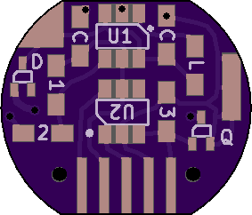
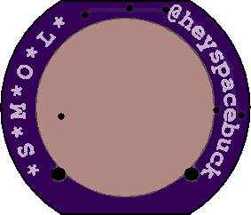

# SMOL Revision history

## Revision 6b
 

I called this "6b" instead of "7" because it's made up of lesser revisions. The component layout is the same as revision 6, but on 6b I changed the routing and board outline, as well as modified the [programmers](programmer.md).

## Revision 6
 

I was super happy with using and programming this version, but it *does* look like a skull. The form factor is not cute enough!

## Revision 5
 

Before trying the card-edge-type teeth of revision 6, I tried using a suuuuper tiny FFC connector to link the board to a programmer. This *could* work, but the part is fragile and not as hand-solderable as the other components.

## Revision 4
 

I think this was the first version I was happy enough to show off to people. Programming/reprogramming still involved soldering wires to the five oval pads on the left. I needed a jumper beneath U2 to finish routing the design, but I still quite like it. It still looks good, to me.

## Revision 3
 

This was the first version to use a SOT-23 microcontroller instead of an SOIC-8 microcontroller. No diode to protect against back EMF. Programmable by soldering wires to those five oval pads.

## Revision 2
 

Just another early revision meant for an ATTiny13 or an ATTiny85.

## Revision 1
 

My goodness, I still can't get over how big those SOIC-8 chips look at this scale.